# GAN, AutoEncoder and PCA

The general purpose of this repo is threefold:

1. Reduce dimensionality of MNIST dataset images and plot in 2D using PCA
2. Reduce dimensionality of MNIST dataset images and plot in 2D using an AutoEncoder
3. Generate fake hand-written digits using a GAN. Feed a 128 length random vector into the generator to generate images.

## PCA

PCA algorithm found in MyPCA.py
Implementation of MNIST found in hw4_q1.py

### Reduction to 2D
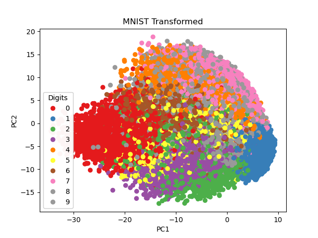

PCA did a good job at separating some digits and others not as well. For example, ‘0’, ‘1’, and ‘2’ all seem to show good separation from other digits. Whereas towards the center of the axis there is a good mix, mostly of ‘6’, ‘5’, ‘3’ and ‘8’. This makes sense as these all can have very similar shapes depending on how they are written.

## AutoEncoder

AutoEncoder found in MyAutoencoder.py
Implmentation on MNIST found in hw4_q2.py

### Reduction to 2D
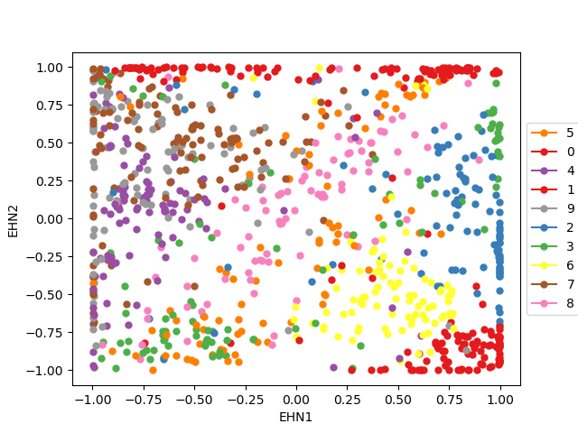

### Loss vs Epoch
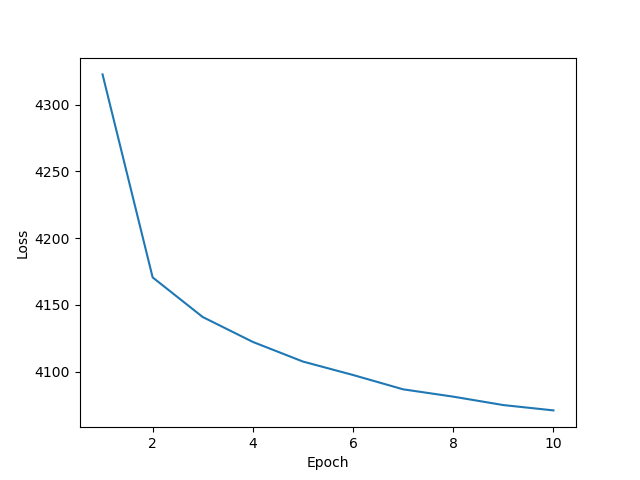

The auto encoder did well in a lot of the same spots as PCA. For example ‘0’ and ‘1’ show good separation from the other digits. ‘0’ in the lower right corner and ‘1’ along the top. Interesting it looks like the autoencoder did a much better job with ‘6’ than PCA. Some of the struggles that the autoencoder experience at the same as PCA. For example, midway between the middle and top left corner this is quite a bit of mixture, ‘7’, ‘9’ and ‘4’ show a decent amount of overlap. Again, this makes sense though considering the similarities of their shapes.

## GAN

Generator found in MyGenerator.py
Discriminator found in MyDiscriminator.py
Implementation found in hw4_q3.py

Over 50 Epochs there is a serious improvement in the generated images. I kept the random input vector the same throughout so I could see how the digits change. I will skip some epochs in this report, but they are all saved in the source data

### Generatered images
#### Epoch 1

#### Epoch 2
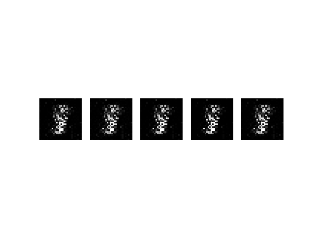
#### Epoch 5
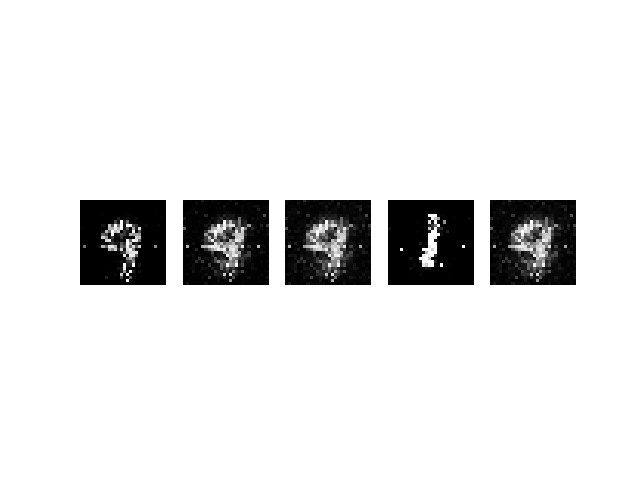
#### Epoch 10
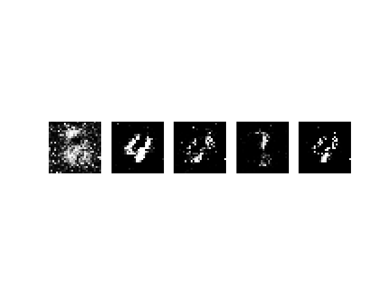
#### Epoch 20
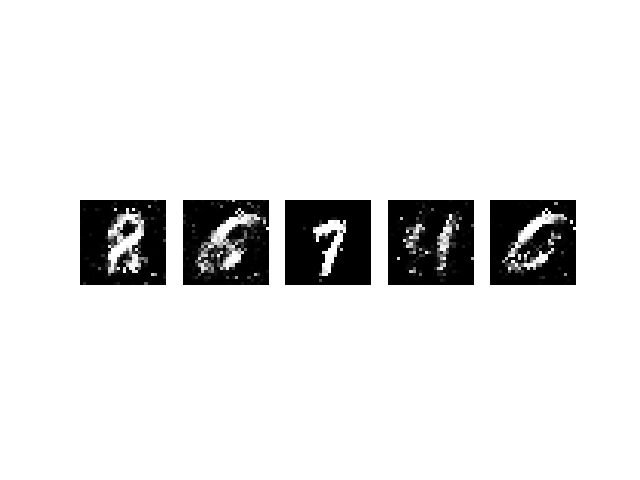
#### Epoch 30
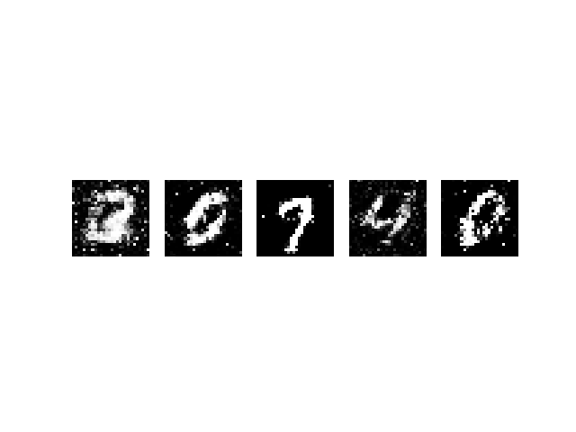
#### Epoch 40
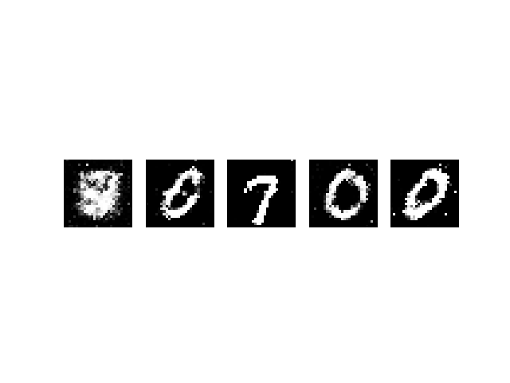
#### Epoch 50
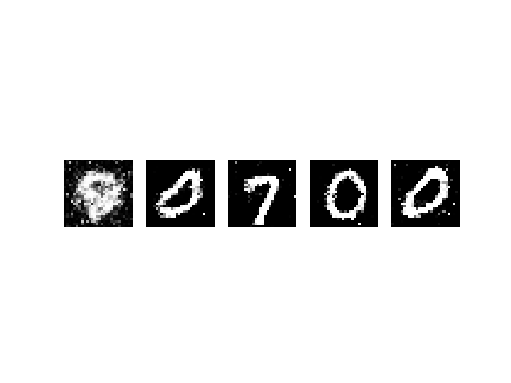

The generator was still having some trouble with the first input digit, it was a much clearer ‘8’ early in the training but the rest of the digits look nearly exactly like you would see them in the set. There is a clear ‘0’, ‘7’, ‘0’, ‘0’. I think that the generator chose 0 for several of these because the features are not as ambiguous as some of the other digits, like we saw the separation with PCA and the autoencoder.

### GAN Loss
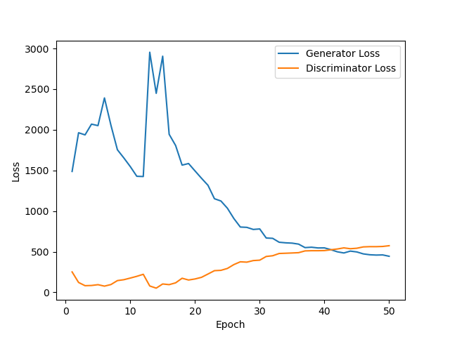
